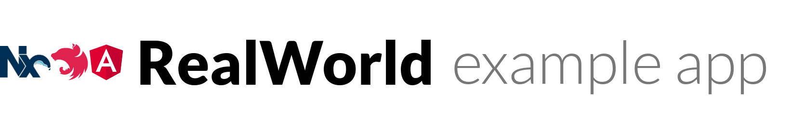

# 

> ### [Nx monorepo](https://nx.dev) with [Nestjs](https://nestjs.com) and [Angular](https://angular.io) codebase containing real world examples (CRUD, auth, advanced patterns, etc) that adheres to the [RealWorld](https://github.com/gothinkster/realworld) spec and API.


This codebase was created to demonstrate a fully fledged fullstack application built with **[Nx monorepo](https://nx.dev), [Nestjs](https://nestjs.com) and [Angular](https://angular.io)** including CRUD operations, authentication, routing, pagination, and more.

# Getting started
*Prerequisites: To run this project locally, you need to have [Nodejs](https://nodejs.org/) and [MySQL](https://www.mysql.com/) installed on your operating system, remember to start your MySQl server also.*

**Clone this project**

`git clone https://github.com/nhaancs/fullstack-nx-nestjs-angular-realworld.git`

**Switch to the repo folder**

`cd fullstack-nx-nestjs-angular-realworld`

**Install dependencies**

`npm install`

**Update below configs in `ormconfig.js` file to your database configs**

`host`, `port`, `username`, `password`, `database`

**Run migrations**

`npm run migration:run`

**Start both server (api) and client (conduit) apps**

`npm run serve:api-conduit`

**Open your browser at [http://localhost:4200](http://localhost:4200)**

You can now register a new account on your own to login and explore other funtionalities like create/update articles, update profile information, favorite articles, follow other users,... 

You also can import dump data that exported in realworld-db-exported.sql file. Once dump data is imported, you can login with 2 pre-registered accounts: 
- Email: user1@email.com / password: qwerty1 
- Email: user2@email.com / password: qwerty1

# Functionality overview
The example application is a social blogging site (i.e. a Medium.com clone) called "Conduit". It uses a custom API for all requests, including authentication.

**General functionality:**
- Authenticate users via JWT (login/signup pages + logout button on settings page)
- CRU* users (sign up & settings page - no deleting required)
- CRUD Articles
- CR*D Comments on articles (no updating required)
- GET and display paginated lists of articles
- Favorite articles
- Follow other users

**The general page breakdown looks like this:**
- Home page (URL: /#/ )
    - List of tags
    - List of articles pulled from either Feed, Global, or by Tag
    - Pagination for list of articles
- Sign in/Sign up pages (URL: /#/login, /#/register )
    - Uses JWT (store the token in localStorage)
    - Authentication can be easily switched to session/cookie based
- Settings page (URL: /#/settings )
- Editor page to create/edit articles (URL: /#/editor, /#/editor/article-slug-here )
- Article page (URL: /#/article/article-slug-here )
    - Delete article button (only shown to article's author)
    - Render markdown from server client side
    - Comments section at bottom of page
    - Delete comment button (only shown to comment's author)
- Profile page (URL: /#/@:username, /#/@:username/favorites )
    - Show basic user info
    - List of articles populated from author's created articles or author's favorited articles

# Project structure
**Application**
- Located in `apps` folder.
- An app produces a binary. It contains the minimal amount of code required to package many libs to create an artifact that is deployed.
- The app defines how to build the artifacts that are shipped to the user. If we have two separate targets (say desktop and mobile), we might have two separate apps.

**Library**
- Located in `libs` folder.
- A lib is a set of files packaged together that is consumed by apps.
- The purpose of having libs is to partition your code into smaller units that are easier to maintain and promote code reuse.

**Library scopes**
- Libs grouped into 2 scopes: `domain` and `shared`
    - Libs have `domain` scope are grouped into one `domain` folder. For example: libs are related to `article` and `user` domain are grouped into `article` and `user` folders.
    - Libs have `shared` scope are created for reusable purpose. They are grouped into `shared` folder. For example: `configuration`, `error-handler`, `logging`,...

**Library types**
- Type relates to the contents of the library and indicates its purpose and usage.
- Libs groups into 2 types: 
    - `feature`: contains mostly smart components, lazy loading modules, or api controllers.
    - `lib`: Libs have type `lib` can be reused in other places.

**Lib tags**
- Every lib must have at least 2 tags: `scope` and `type`
- For example: Lib `libs/shared/configutaion` has tag `scope:shared,type:lib`, lib `libs/article/feature` has tag `scope:domain,type:feature`, lib `libs/article/shared` has tag `scope:domain,type:lib`.

**Workspace structure**

```
apps
|____api
|____conduit
|____conduit-2e2
libs
|____article
|    |____api
|    |    |____handlers
|    |    |____shared
|    |____api-interfaces
|    |____feature
|    |____shared
|
|____user
|    |____api
|    |    |____handlers
|    |    |____shared
|    |____api-interfaces
|    |____feature
|    |____shared
|       
|____shared
     |____api
     |    |____config
     |    |____constants
     |    |____core
     |    |____error-handler
     |    |____foundation
     |    |____validations
     |____client-server
     |____common
     |____configuration
     |____constants
     |____core
     |____directives
     |____error-handler
     |____foundation
     |____interceptors
     |____loading
     |____logging
     |____notification
     |____spinner
     |____storage
     |____string-util
     |____toaster
```